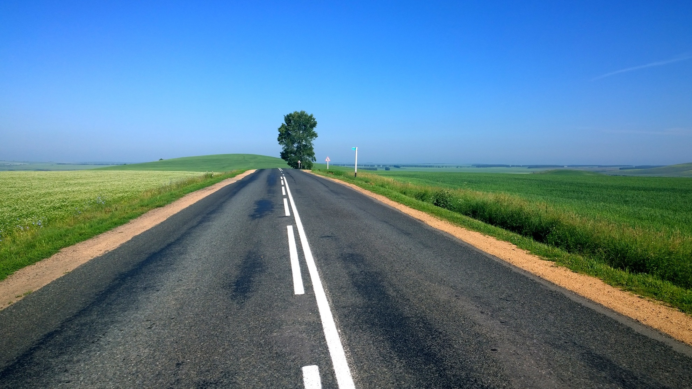

## Thumbnail

This post contains a `thumbnail` in its front-matter:

```
---
thumbnail: image_thumbnail.png
---
```

This thumbnail is what will be shown on the home page of the website.

## Images in the article

Images can be included the post itself:

```
<!-- image in the same directory -->

<!-- image in a sub-directory -->

```


Note that all paths are relative to the article itself. Consequently the easiest
way to organise files is to place them in the same directory as the article.

## Gallery of images

You can use the following syntax in the markdown document:



